# Following money out of a sanctioned mixer

**An empirical study of connectivity between Tornado Cash and Railgun on
Ethereum mainnet.**

---

## 1. Introduction

On 8 August 2022 the US Treasury's Office of Foreign Assets Control designated
Tornado Cash, naming 38 specific Ethereum addresses. It was the first time a
sanctions authority had listed autonomous software rather than a person or an
organisation, and it raised a question nobody could answer at the time: what
would the people using it do next?

The obvious hypothesis was migration. Railgun offers comparable privacy, was not
designated, and was operating. If Tornado's users wanted to keep doing what they
had been doing, Railgun was the place to do it.

This study measures whether that happened, how large the connection is, what the
people involved actually did, and — more usefully than any of those — where the
measurement stops working.

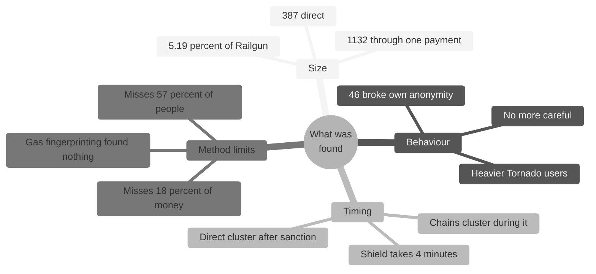

The short answer is that the connection is small, specific, and not what the
migration hypothesis predicts. About one Railgun user in twenty is reachable
from a sanctioned Tornado withdrawal within a single payment. Those users
handled Tornado more heavily than comparable people who never touched Railgun,
but no more carefully. And the timing runs the wrong way for a migration story:
direct connections cluster *after* the designation was lifted, not during it.

One further result cuts against the argument this work was expected to support.
Published tracing techniques fail on a clear majority of these addresses, but
the addresses they fail on hold almost none of the money.

---

## 2. Background

### 2.1 What the two protocols do

Everything on Ethereum is public. Amounts, timings, counterparties. Privacy
tools cannot conceal a transaction, so instead they sever the link between
transactions.

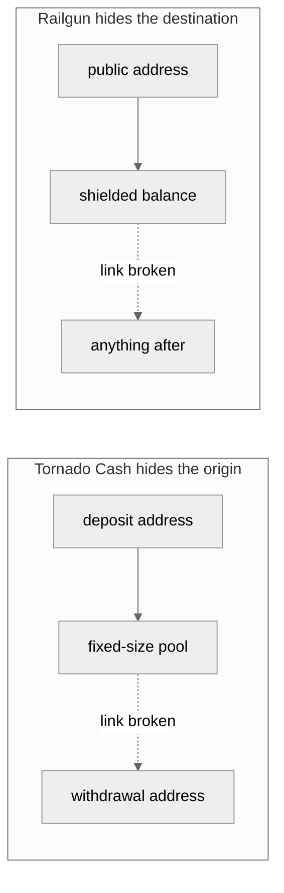

**Tornado Cash** takes a fixed amount from one address and later returns the
same amount to a fresh one. Both events are public; nothing on the chain
connects them. Amounts are fixed at 0.1, 1, 10 or 100 ETH precisely so the
amount itself reveals nothing.

**Railgun** takes funds from a public address into a private balance, a step
called *shielding*. That transaction is necessarily public. Everything
afterwards is not.

### 2.2 The relayer problem

A newly created withdrawal address holds nothing, and every Ethereum transaction
costs a fee. Funding it beforehand would create a payment pointing directly at
it, undoing the entire exercise.

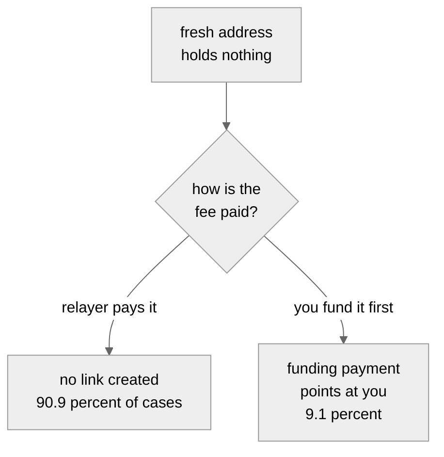

That 9.1% who paid their own fee made a mistake, and the rate is a usable
measure of operational care throughout this study.

### 2.3 The question

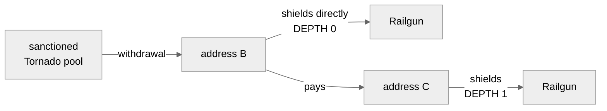

Two patterns. **Depth 0** is one address doing both jobs. **Depth 1** is a chain
with one address in between. Their disagreement turns out to be the most
informative result in the study.

---

## 3. Data and methodology

### 3.1 The collection pipeline

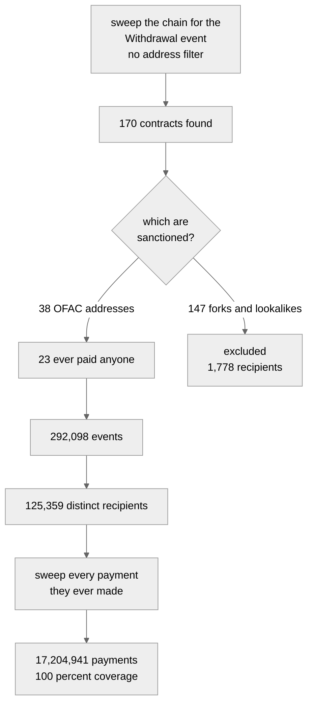

All data came from an Ethereum archive node. No third-party service, no
commercial dataset, no purchased address labels.

| Dataset | Volume |
|---|---:|
| Tornado withdrawals | 292,098 events |
| Restricted to designated contracts | 125,359 recipients |
| Tornado deposits | 311,199 events |
| Deposit senders resolved | 310,087, 99.6% |
| Railgun shielders | 29,256 addresses |
| Outward payments collected | 17,204,941 |

### 3.2 Three decisions that shaped everything

**The event rather than value transfers.** A pool paying out DAI moves no ETH.
Searching for ETH movements would have silently omitted every stablecoin
withdrawal. The `Withdrawal` event is emitted by inherited code before the
asset-specific payment, so it fires identically for every denomination.

**No address filter during collection.** The sweep found 170 contracts emitting
that event against about twenty Tornado ever deployed. Had it been restricted to
known addresses, the forks would have been invisible. Six of them are ETH mixers
whose first payout came within seven weeks of the designation.

**Restriction to the designated list afterwards.** A withdrawal from an
unsanctioned clone is not a withdrawal from the sanctioned entity.

### 3.3 One documented exclusion

779 events decoded a zero recipient. 775 originate from a handful of
transactions within sixteen blocks of the 0.1 ETH pool's deployment in December
2019, each emitting the event exactly 100 times. That is contract
initialisation, and a zero recipient cannot be a controlled address.

### 3.4 The comparison design

Descriptive statistics about a selected group mean little without a comparison.
Saying 26% of these addresses used multiple pool sizes invites the question:
compared to what?

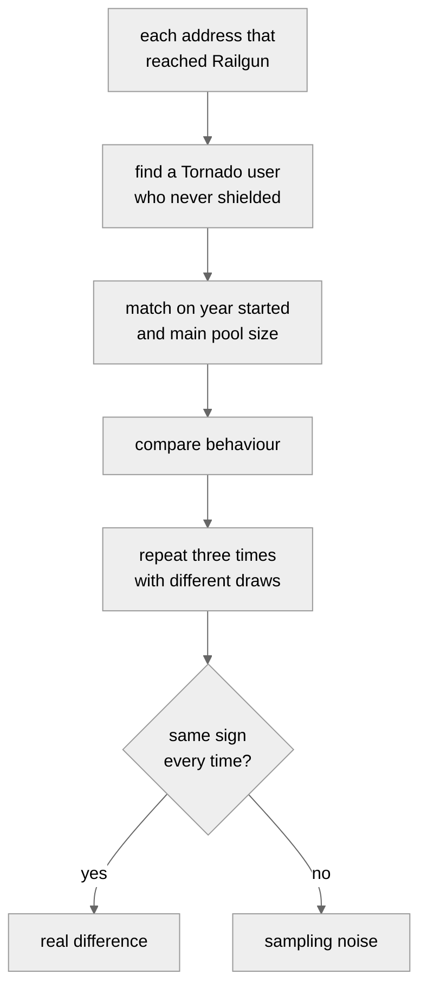

For **depth 1** the unit is a pair, so the control had to be a pair: B′ pays C′
where C′ never shielded. That required drawing from the 27-million-payment
forward graph rather than the withdrawal list.

---

## 4. Results

### 4.1 The headline

| | Shielders reached | Share of 29,256 | 95% interval |
|---|---:|---:|---:|
| **Depth 0** | 387 | 1.32% | 1.20 – 1.46% |
| **Depth 1** | 1,132 | 3.87% | 3.66 – 4.09% |
| **Combined** | **1,519** | **5.19%** | |

Depth 0 is the most reliable figure here. It requires no payment tracing, no
graph, no judgement calls. Two independent collection methods, one working
backward from Railgun and one forward from Tornado across 17.2 million payments,
produced the same 387.

### 4.2 Four kinds of user

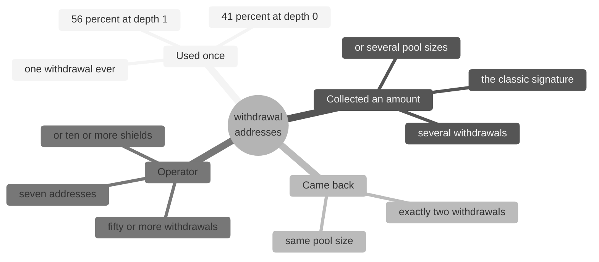

Because Tornado only pays fixed sizes, somebody wanting 43 ETH must take 10 four
times and 1 three times. That behaviour is both a practical necessity and a
signature, since those withdrawals plainly belong together.

### 4.3 Value is extraordinarily concentrated, differently at each depth

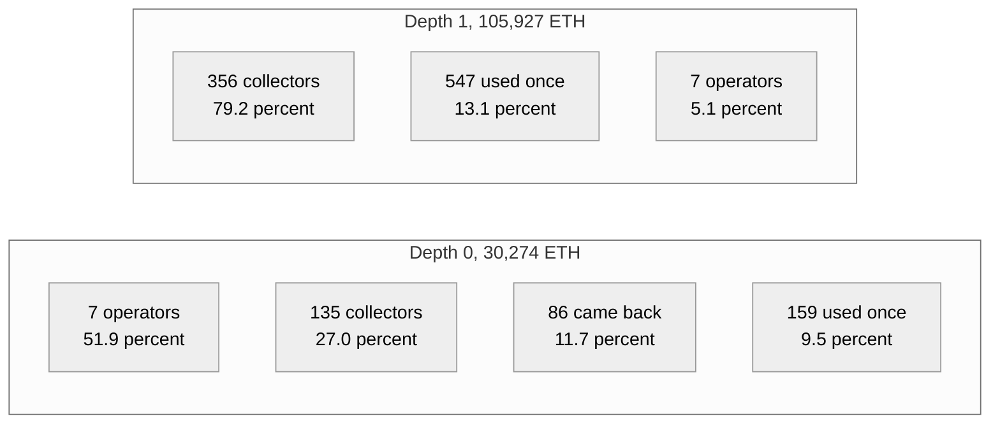

At depth 0, seven addresses hold 51.9% of the value, averaging 2,245 ETH each
against 18 for the single-use group — a ratio of 125 to 1. At depth 1 those same
operators hold 5.1% and the collectors dominate at 79.2%.

These are not one population behaving differently. They are different kinds of
user, and any statement about either must say whether it counts addresses or
money, because the two give opposite pictures.

### 4.4 The shape of a chain

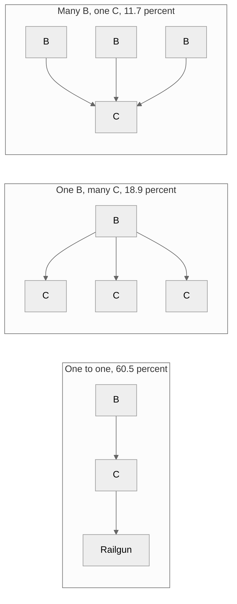

Six chains in ten are a simple line. The remaining four sit inside a wider
structure, and describing them as one person routing money through one
intermediate would be wrong.

The "many B, one C" group deserves particular scepticism. **91% of those
recipients already had a transaction history**, against 55% for the simple
chains, which fits a collection point rather than a purpose-made conduit.

### 4.5 What the recipients looked like

An address's transaction count rises only when it *sends*. Money arriving does
not change it. So an address with a count of one has done exactly one thing in
its existence.

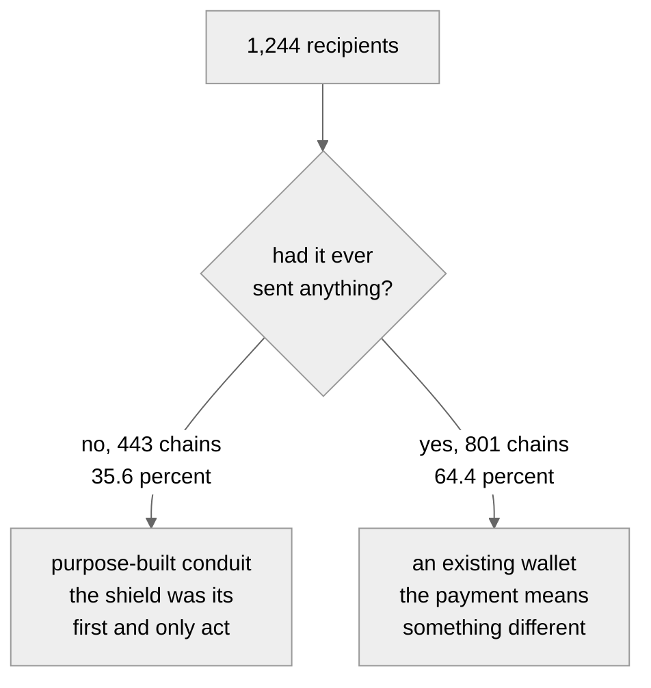

About a third of recipients were purpose-built conduits. Two thirds were not,
which sits awkwardly with the standard description of this pattern as money
passing through a disposable address.

### 4.6 Timing: two gaps that behave nothing alike

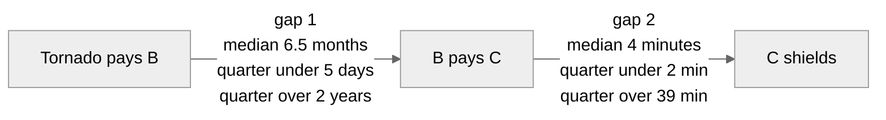

**Gap 2 is bimodal, not simply fast.**

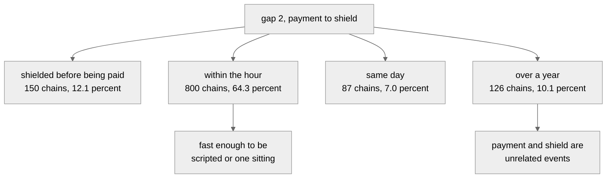

Among the 1,094 chains that run in the right order, **73.1% shielded within the
hour**.

**And the two gaps are independent:**

| | Chains | Shielded same day |
|---|---:|---:|
| B paid onward within a week | 326 | 78.8% |
| B waited over a year | 511 | 78.3% |

Identical. How long the withdrawal address held the money says nothing about how
fast the recipient acted. That suggests two separate decisions by two different
parties, or one automated step following one human one.

End-to-end timing tracks gap 1 almost exactly, so reporting it adds nothing over
reporting gap 1.

### 4.7 The comparison: heavier, not more careful

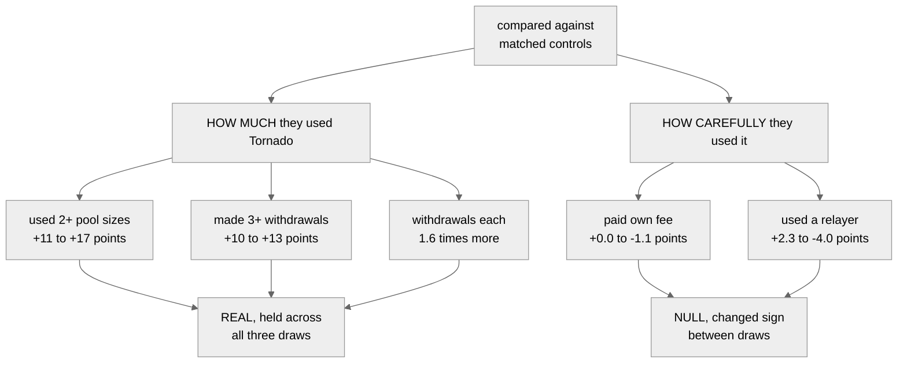

Every activity measure is higher, at both depths. Every discipline measure is
indistinguishable, and at depth 0 they *change sign* between draws, making them
nulls rather than small effects.

The most plausible reading: finding Railgun, understanding shielding and
trusting a second protocol all require engagement that casual users lack. But
knowing Railgun exists tells you nothing about whether you remember to use a
relayer. **Sophistication and carefulness are different things, and the data
separates them cleanly.**

### 4.8 Users who destroyed their own anonymity

Tornado's guarantee holds against the protocol. It does not hold against a user
who deposits and withdraws with the same address.

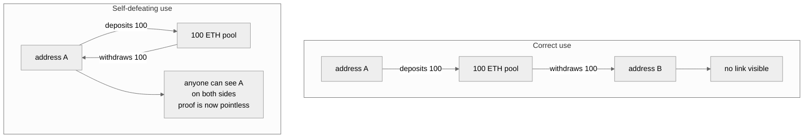

| | Count | Share |
|---|---:|---:|
| Distinct depositors, whole protocol | 65,226 | |
| Also appear as a withdrawal recipient | 11,976 | 18.4% |
| **Same address, same pool** | **8,533** | **13.1%** |
| Depth 0 addresses that also deposited | 63 | 16.3% |
| **Of those, same address same pool** | **46** | **11.9%** |

**One depositor in eight, across the entire history of the protocol, did this.**

Those 46 addresses account for **41.5% of the ETH** in the depth 0 set, or 22.1%
once a single large contract is set aside. The mistake was made
disproportionately by people moving large sums.

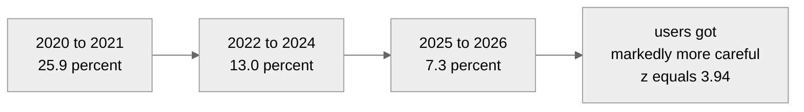

Because cohort composition did not change, this is a genuine improvement in
behaviour rather than a shift in who was using the protocol.

Self-matching also concentrates in heavy users: 42.9% of operators against 3.8%
of single-use addresses.

The clearest single case made **nine deposits and nine withdrawals from the 100
ETH pool with one address** — 900 ETH in, 900 ETH out, no anonymity gained at
any point — and then shielded.

### 4.9 A published method that failed

Gas price fingerprinting holds that people set idiosyncratic gas prices which
recur, so an unusual price shared by two transactions suggests one sender.

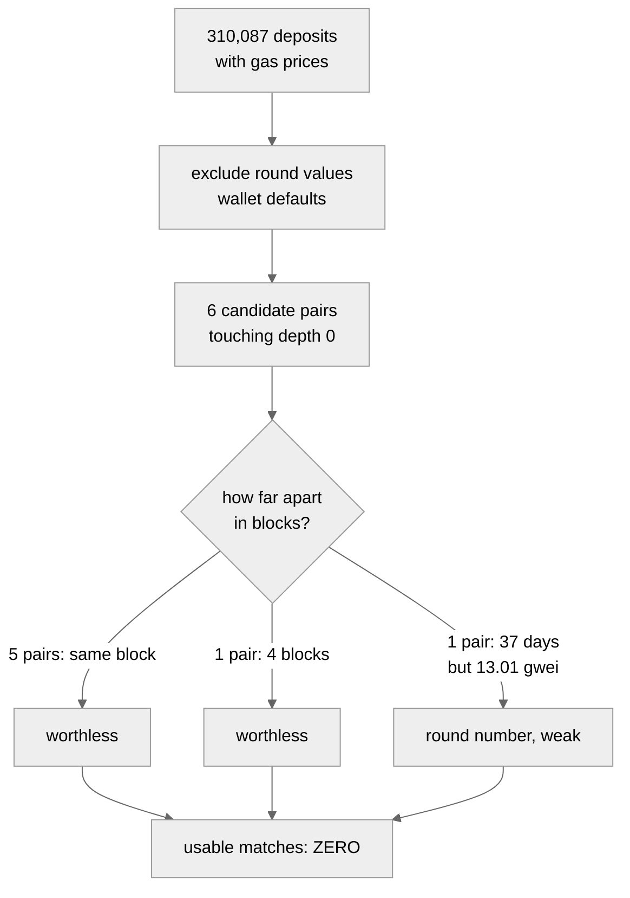

**Why same-block is fatal rather than unlucky:** block builders order
transactions by gas price. Two transactions bidding the same price land in the
same block *by construction*. A shared price predicts a shared block and says
nothing about a shared sender.

The threshold was also barely selective. With 311,199 transactions across
182,539 distinct prices, an average price appears 1.7 times, so 98% qualify as
"rare" by construction.

This is reported because a method run and failed is a stronger claim than a
method never attempted.

### 4.10 Traceability, and a result that cuts the wrong way

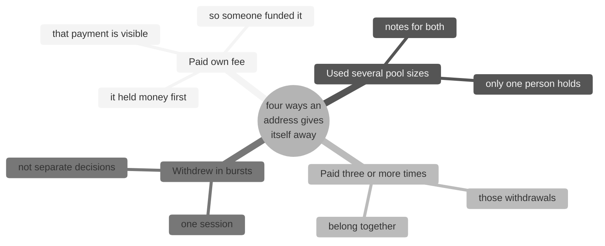

| | Addresses | Share | ETH | Share of value | Mean |
|---|---:|---:|---:|---:|---:|
| Detected | 165 | 42.6% | 24,782.6 | **81.9%** | 150.2 |
| **Not detected** | **222** | **57.4%** | 5,491.3 | **18.1%** | 24.7 |

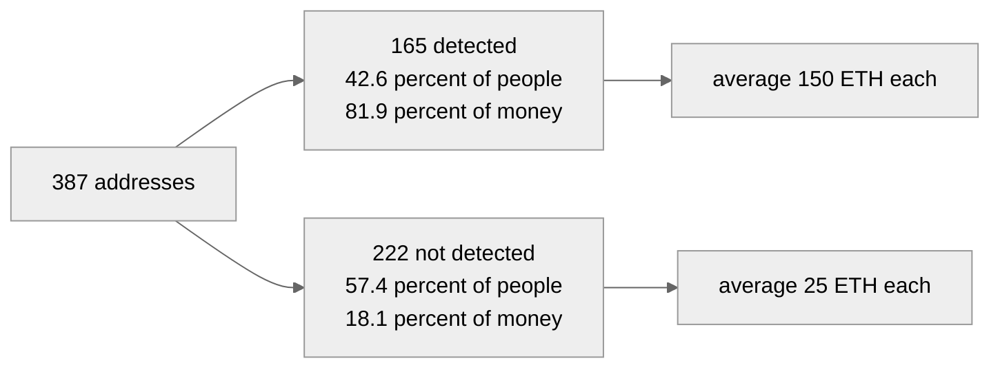

At depth 1 the same test gives 60.0% of chains detected holding **92.4%** of the
value.

**Standard techniques miss most of the people and almost none of the money.**
The undetected population is not merely a minority of value — it is a poor one.

An honest qualification: three of the four techniques cannot fire on an address
used once, so part of that 57.4% is arithmetic rather than evasion. What these
methods detect is **reuse**, and 41.1% of this population never reused.

### 4.11 The two depths disagree about the sanction

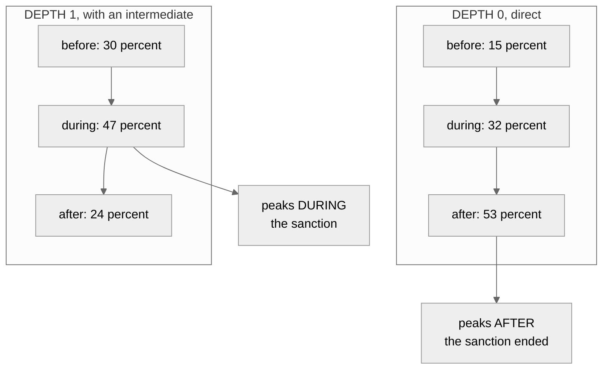

The obvious objection — that this reflects Tornado being busier in one period —
was tested. Tornado's own withdrawal volume in 2025–26 was **30.2%** of all
time. The depth 0 figure of 53.2% has an interval of 48.3–58.2%, which does not
come near it.

The chain shapes corroborate the pattern:

| Period | Simple one-to-one chains | Chains involving a service |
|---|---:|---:|
| 2020–21 | 44% | 8% |
| 2022–24 | 66% | 7% |
| **2025–26** | **70%** | **0%** |

Chains became steadily simpler, and exchange involvement disappeared entirely.
Every service-linked chain in the dataset predates 2025.

**The reading:** while the designation was in force, people inserted an
intermediate address to put distance between themselves and the mixer. Once it
was lifted, they stopped bothering.

### 4.12 Who was removed, and why it barely mattered

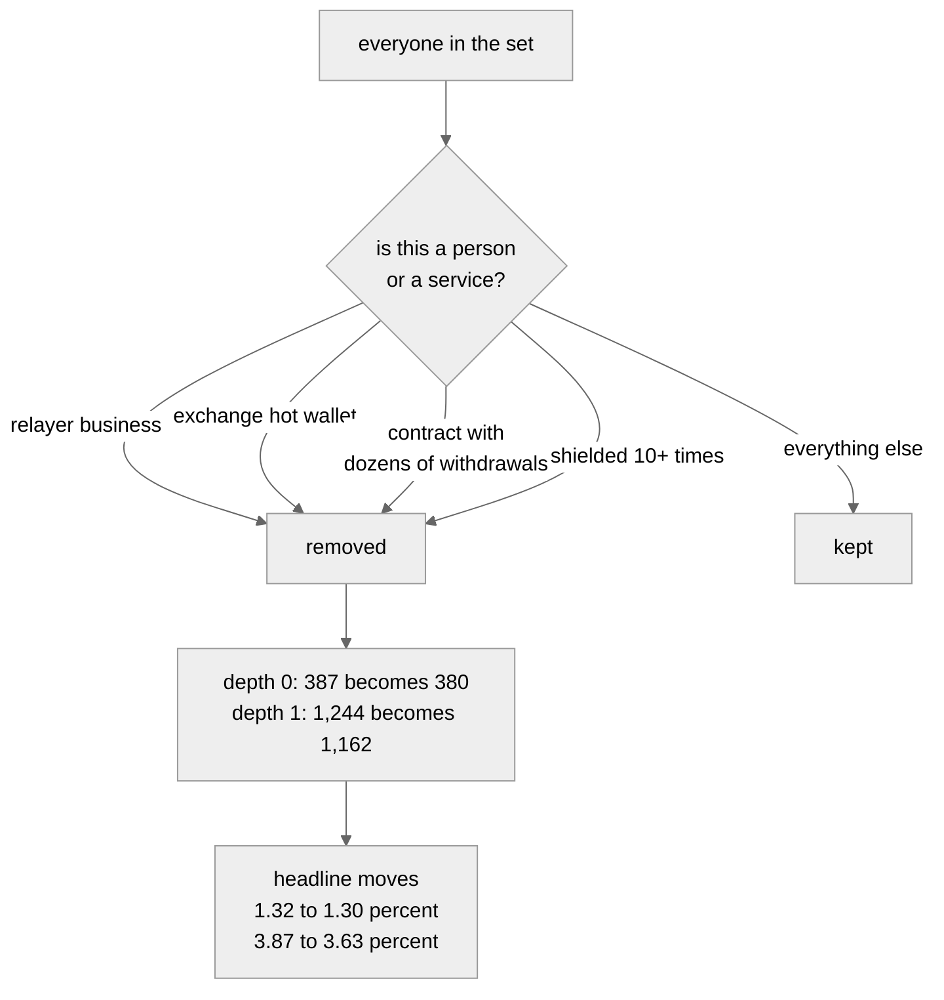

That the correction is so small is itself informative: the result does not
depend on where those lines are drawn.

---

## 5. Discussion

### 5.1 The migration hypothesis does not survive

If the designation had driven Tornado's users toward Railgun, the direct
connection should cluster in 2022 and 2023. It does the opposite.

It is also worth stating plainly that the funds were never frozen. The pools are
immutable contracts with no owner and no pause function — the basis of the *Van
Loon* ruling in November 2024. The designation made transacting with those
addresses a legal offence for US persons; it did not and could not stop
withdrawals, which continued throughout at roughly 1,400 a month.

### 5.2 What did change was chain structure

The depth 1 concentration during the designation, together with the shape trend,
suggests the designation altered *method* rather than *volume*. People kept
using Tornado. While the sanction was live, more of them added a step.

This is the more interesting finding for a proportionality analysis, because it
is evidence that a designation changes conduct without necessarily reducing
activity.

### 5.3 The evidentiary picture is double-edged

```mermaid
%%{init: {'theme':'neutral'}}%%
flowchart TD
    A[what can be established?] --> B[counting addresses]
    A --> C[counting money]
    B --> B1[57 percent cannot<br/>be characterised]
    C --> C1[82 percent sits with<br/>addresses that can]
    B1 --> D[supports: most individuals<br/>are beyond reach]
    C1 --> E[undercuts: large flows<br/>are largely attributable]
```

An honest treatment states both. A regulator concerned with large-value flows is
in a considerably better position than the address count suggests. A person
worried about mass surveillance of small users is right that most individuals
are invisible.

### 5.4 Where measurement genuinely stops

```mermaid
%%{init: {'theme':'neutral'}}%%
flowchart LR
    A[125,359 seeds] -->|one payment out| B[1,826,874 addresses<br/>14.6 times more]
    B -->|another payment out| C[a substantial share of<br/>everything active<br/>on Ethereum]
    C --> D[at two intermediates<br/>40.5 percent of all<br/>Railgun users qualify]
    D --> E[91.7 percent of that runs<br/>through 149 shared utilities<br/>WETH, 1inch, Railgun's own helper]
```

Extending by one further hop was attempted and abandoned. A path through WETH
means one person wrapped ETH and an unrelated person later unwrapped some. This
is a property of the transfer graph, not of either protocol, and no better node
or longer sweep changes it.

---

## 6. Limitations

```mermaid
%%{init: {'theme':'neutral'}}%%
mindmap
  root((what this<br/>cannot say))
    Railgun withdrawals
      never collected
      cannot tell a waypoint
      from a destination
      THE LARGEST GAP
    Identity
      a payment is not
      an identity claim
      387 addresses are
      at most 371 actors
    Bounds
      not an upper bound
      extra hops are absent
      not a lower bound
      some links are incidental
    Coverage
      Railgun starts May 2022
      only 57 shielders
      predate the sanction
```

**Railgun unshields were never collected.** We know these addresses put money
into Railgun; we do not know whether they took it back out. Rapid unshielding
would indicate a waypoint in a chain; leaving funds shielded would indicate a
destination. Those support very different readings and the data to separate them
was not gathered.

**Threshold choices are judgement calls.** Service, relayer and operator
boundaries were set by the author and tested for sensitivity. The depth 0
segments proved stable across every cutoff from 10 to 200 withdrawals; the depth
1 fan-out threshold did not, and empties entirely at a cap of 50.

---

## 7. Conclusion

```mermaid
%%{init: {'theme':'neutral'}}%%
mindmap
  root((Conclusion))
    Size
      one Railgun user in twenty
      reachable within one payment
    Who
      heavier Tornado users
      no more careful
      46 destroyed own anonymity
    The sanction
      did not drive migration
      direct links peak after it
      chains peak during it
      it changed method not volume
    Measurement
      fails on most people
      succeeds on most money
      stops entirely at two hops
```

Roughly one Railgun user in twenty is reachable from a sanctioned Tornado Cash
withdrawal within a single payment — 387 directly, 1,132 through one
intermediate, 5.19% of the protocol's users combined.

The people involved used Tornado more heavily than matched peers who never
shielded, but handled it no more carefully. Forty-six of them destroyed their
own anonymity through address reuse, and those forty-six account for a
disproportionate share of the value.

The designation does not appear to have driven migration. Direct connections
concentrate *after* it was lifted. What it does appear to have changed is
method: chains with an intermediate address cluster during the sanction and
became simpler once it ended.

And the tracing picture depends entirely on what you count. By address, most of
this population is beyond the reach of published techniques. By value, most of
it is not.

---

## Reproducing this work

Every figure derives from scripts in this repository, run against an Ethereum
archive node. See [README.md](README.md) for the file manifest and
[RESULTS.md](RESULTS.md) for the complete tables, including a list of figures
that did not survive checking and what replaced them.

Narrative reports written for readers without a background in this:
[DEPTH0.pdf](DEPTH0.pdf) and [DEPTH1.pdf](DEPTH1.pdf).
