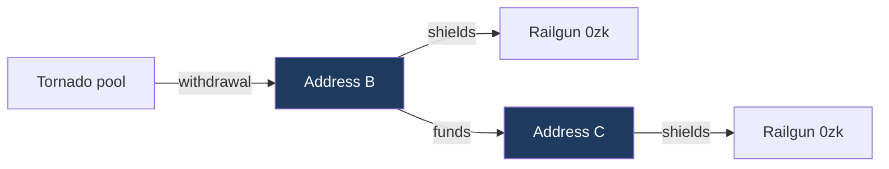

# Tornado Cash to Railgun

## Headline

| | Shielders | Share of all shielders |
|---|---:|---:|
| Reached at depth 0 or 1 | 1,883 | 6.44% |
| Depth 0, same address on both sides | 387 | 1.32% |
| Depth 1, funded by a withdrawal address | 1,496 | 5.11% |
| All Railgun shielders | 29,256 | 100% |

Depth 1 comes from 1,698 withdrawal address to shielder pairs, involving 1,002
distinct withdrawal addresses. There are more pairs than shielders because some
shielders received money from more than one withdrawal address. The two depths
are disjoint, so no shielder is counted twice.

The withdrawal set is restricted to contracts named in the OFAC designation of
8 August 2022.

## By year

The share column is the one that carries meaning. Counts track Railgun's own
growth.

| Year | New shielders | Depth 0 | Share | Depth 1 | Share |
|---|---:|---:|---:|---:|---:|
| 2022 | 454 | 5 | 1.10% | 71 | 15.64% |
| 2023 | 2,863 | 75 | 2.62% | 349 | 12.19% |
| 2024 | 6,240 | 61 | 0.98% | 356 | 5.71% |
| 2025 | 11,078 | 146 | 1.32% | 488 | 4.41% |
| 2026 | 8,621 | 100 | 1.16% | 232 | 2.69% |

**The two depths behave differently, and that is the finding.**

Depth 1 falls monotonically after 2022, from 15.64% to 2.69%, a decline of
roughly six times. Depth 0 shows no trend at all, moving between 0.98% and
2.62% with no direction across five years.

Neither pattern is what a designation driven migration predicts. That account
requires a rise after August 2022 sustained thereafter. Depth 1 was already at
its highest before the designation and has fallen ever since. Depth 0 is flat
throughout.

What fits instead is that Railgun's earliest users were drawn
disproportionately from an existing privacy tool population overlapping with
Tornado, and that later growth diluted them. That dilution is visible in the
funded intermediary pattern and not in the direct one, which suggests the
shrinking overlap sits in how people route funds rather than in whether they
use both tools.

## Around the designation

| Month | New shielders | Depth 0 | Depth 1 |
|---|---:|---:|---:|
| 2022-07 | 19 | 2 | 4 |
| **2022-08** | 66 | **0** | 20 |
| 2022-09 | 88 | 1 | 13 |
| 2022-10 | 61 | 0 | 10 |
| 2022-11 | 86 | 0 | 6 |
| 2022-12 | 96 | 2 | 11 |

August 2022, the month of the designation, contains **no depth 0 overlaps at
all** out of 66 new shielders. The four months following it contain three
between them. The first overlap in the series appears in July 2022, before the
designation rather than after it.

At depth 1 the designation month reaches 30.30%, against 21.05% in July and
21.74% in June. On a base of 57 shielders across those three months, that
difference does not support an inference.

## Month by month

| Month | New shielders | Depth 0 | Share | Depth 1 | Share |
|---|---:|---:|---:|---:|---:|
| 2022-05 | 15 | 0 | 0.00% | 2 | 13.33% |
| 2022-06 | 23 | 0 | 0.00% | 5 | 21.74% |
| 2022-07 | 19 | 2 | 10.53% | 4 | 21.05% |
| **2022-08** | 66 | 0 | 0.00% | 20 | 30.30% |
| 2022-09 | 88 | 1 | 1.14% | 13 | 14.77% |
| 2022-10 | 61 | 0 | 0.00% | 10 | 16.39% |
| 2022-11 | 86 | 0 | 0.00% | 6 | 6.98% |
| 2022-12 | 96 | 2 | 2.08% | 11 | 11.46% |
| 2023-01 | 200 | 1 | 0.50% | 79 | 39.50% |
| 2023-02 | 155 | 5 | 3.23% | 9 | 5.81% |
| 2023-03 | 186 | 11 | 5.91% | 16 | 8.60% |
| 2023-04 | 253 | 10 | 3.95% | 25 | 9.88% |
| 2023-05 | 223 | 9 | 4.04% | 18 | 8.07% |
| 2023-06 | 259 | 5 | 1.93% | 43 | 16.60% |
| 2023-07 | 218 | 3 | 1.38% | 26 | 11.93% |
| 2023-08 | 253 | 8 | 3.16% | 24 | 9.49% |
| 2023-09 | 243 | 4 | 1.65% | 20 | 8.23% |
| 2023-10 | 282 | 6 | 2.13% | 27 | 9.57% |
| 2023-11 | 299 | 3 | 1.00% | 32 | 10.70% |
| 2023-12 | 292 | 10 | 3.42% | 30 | 10.27% |
| 2024-01 | 330 | 6 | 1.82% | 30 | 9.09% |
| 2024-02 | 252 | 2 | 0.79% | 23 | 9.13% |
| 2024-03 | 370 | 2 | 0.54% | 21 | 5.68% |
| 2024-04 | 408 | 2 | 0.49% | 21 | 5.15% |
| 2024-05 | 668 | 8 | 1.20% | 35 | 5.24% |
| 2024-06 | 626 | 14 | 2.24% | 46 | 7.35% |
| 2024-07 | 479 | 5 | 1.04% | 29 | 6.05% |
| 2024-08 | 706 | 6 | 0.85% | 33 | 4.67% |
| 2024-09 | 705 | 7 | 0.99% | 34 | 4.82% |
| 2024-10 | 606 | 3 | 0.50% | 22 | 3.63% |
| 2024-11 | 556 | 4 | 0.72% | 32 | 5.76% |
| 2024-12 | 534 | 2 | 0.37% | 30 | 5.62% |
| 2025-01 | 648 | 3 | 0.46% | 36 | 5.56% |
| 2025-02 | 604 | 1 | 0.17% | 21 | 3.48% |
| 2025-03 | 822 | 4 | 0.49% | 26 | 3.16% |
| 2025-04 | 867 | 19 | 2.19% | 28 | 3.23% |
| 2025-05 | 834 | 5 | 0.60% | 30 | 3.60% |
| 2025-06 | 787 | 4 | 0.51% | 36 | 4.57% |
| 2025-07 | 728 | 7 | 0.96% | 35 | 4.81% |
| 2025-08 | 1,166 | 6 | 0.51% | 37 | 3.17% |
| 2025-09 | 1,095 | 20 | 1.83% | 79 | 7.21% |
| 2025-10 | 1,118 | 14 | 1.25% | 51 | 4.56% |
| 2025-11 | 966 | 47 | 4.87% | 45 | 4.66% |
| 2025-12 | 1,443 | 16 | 1.11% | 64 | 4.44% |
| 2026-01 | 1,666 | 14 | 0.84% | 47 | 2.82% |
| 2026-02 | 978 | 4 | 0.41% | 27 | 2.76% |
| 2026-03 | 1,123 | 17 | 1.51% | 39 | 3.47% |
| 2026-04 | 943 | 2 | 0.21% | 26 | 2.76% |
| 2026-05 | 997 | 11 | 1.10% | 29 | 2.91% |
| 2026-06 | 1,075 | 28 | 2.60% | 34 | 3.16% |
| 2026-07 | 1,336 | 15 | 1.12% | 21 | 1.57% |
| 2026-08 | 503 | 9 | 1.79% | 9 | 1.79% |

August 2022, the designation month, is in bold. The busiest month by count is
November 2025 at depth 0 with 47, and September 2025 at depth 1 with 79. Both
sit more than three years after the designation.

## Lag structure

**Depth 0, withdrawal to shield**

| | Count | Share |
|---|---:|---:|
| Negative, out of order | 17 | 4.4% |
| Same day | 204 | 52.7% |
| 1 to 7 days | 24 | 6.2% |
| 7 to 30 days | 17 | 4.4% |
| 30 to 90 days | 15 | 3.9% |
| 90 days to 1 year | 9 | 2.3% |
| Over a year | 101 | 26.1% |

Median 0.1 days, longest 2,287 days. More than half withdraw and shield on the
same day.

**Depth 1, three legs**

| | Withdrawal to funding | Funding to shield | End to end |
|---|---:|---:|---:|
| Negative, out of order | 151, 8.9% | 200, 11.8% | 55, 3.2% |
| Same day | 254, 15.0% | 1,018, 60.0% | 210, 12.4% |
| 1 to 7 days | 51, 3.0% | 48, 2.8% | 51, 3.0% |
| 7 to 30 days | 69, 4.1% | 24, 1.4% | 61, 3.6% |
| 30 to 90 days | 82, 4.8% | 28, 1.6% | 66, 3.9% |
| 90 days to 1 year | 244, 14.4% | 55, 3.2% | 192, 11.3% |
| Over a year | 847, 49.9% | 325, 19.1% | 1,063, 62.6% |
| **Median** | **362.1 days** | **0.0 days** | **698.0 days** |

The shape is consistent and specific. The withdrawal address holds funds for a
long time, a median of nearly a year and almost half for more than one, and
then the recipient shields the same day it is paid in 60% of cases. The hop
itself is immediate. All of the delay sits upstream of it.

The same immediacy appears at depth 0 directly, where the median gap between
withdrawing and shielding is a fraction of a day.

That is a recognisable operational signature. An address funded and used within
a single day, for the single purpose of shielding, is behaving as a purpose
created intermediate rather than as an ordinary wallet that happened to receive
a payment. It supports reading these chains as deliberate, while the long
upstream delay argues against any of it being a reaction to a specific event.

Ordering is reported and never applied. The negative rows are pairs where the
events run the wrong way round, and they are counted rather than removed.

## Coverage

| | |
|---|---:|
| Designated addresses | 38 |
| Of those, emitting withdrawal events | 23 |
| Withdrawal events collected | 281,121 |
| Distinct recipients | 125,092 |
| Railgun shielders | 29,256 |
| Shielders with at least one funding row | 29,237, 99.9% |
| Funding edges examined | 1,872,205 |
| Blocks swept | 16,660,000 |

1,872,205 is the search space, every incoming payment to any shielder from any
source. 1,698 of them had a designated contract's withdrawal recipient as
sender, roughly nine in every ten thousand.

The 15 designated addresses that emitted no withdrawal events are routers and
proxies, which do not emit the event.

The withdrawal set is built from the `Withdrawal` event rather than from ETH
value transfers, so it covers every denomination. Pools paying out in DAI,
USDC, USDT or WBTC move no ETH and produce no value bearing trace, and are
invisible to a trace based method. The event is emitted by the pool contract
regardless of what it pays out.

Relayers are named separately by the event, in an indexed topic distinct from
the recipient field, so no frequency heuristic is used to separate them. They
are excluded by construction, and the relayer count at every cutoff level is
zero.

## Robustness

The withdrawal set was collected three times, using methods that share almost
nothing, and the result is stable across all of them.

| | Traces, ETH pools | Logs, every emitter | Logs, designated |
|---|---:|---:|---:|
| Distinct recipients | 124,181 | 126,870 | **125,092** |
| Depth 0 | 384 | 391 | **387** |
| Depth 1 | 1,502 | 1,508 | **1,496** |
| Reached at depth 0 or 1 | 1,886 | 1,899 | **1,883** |

Depth 1 varies by 0.8% across the three. The finding does not depend on the
collection method.

Restricting from every contract emitting the event to the designated list
removed 147 contracts and 1.4% of recipients, and changed the result by 0.84%.
The contract list is not carrying the finding.

Depth 1 is also insensitive to the relayer cutoff. Between a cutoff of 25 and
none at all it moves from 1,465 to 1,496, and depth 0 from 384 to 387.

Payout counts across methods are not comparable. Traces recorded 498,710
payments because a relayed withdrawal pays twice out of the pool, once to the
recipient and once to the relayer. Logs record one event per withdrawal.
Payments fell while recipients rose, which confirms the two count different
things.

## Limits

**Observation window.** The shielder set begins at block 14,751,290, May 2022.
Railgun deployed in December 2021, so the first months are absent, likely
because Railgun sits behind an upgradeable proxy and a V1 shield event under a
different signature would be invisible to a filter written for the V2 event.
Only 57 shielders fall before the designation, 0.195% of the observation
window, so any before and after comparison rests on a narrow base.

**Funding layer covers ETH only.** The withdrawal set covers all denominations,
but incoming payments to shielders were collected from ETH value transfers.
Someone funded in USDC before shielding is invisible. Both depth figures are
floors.

**A funding edge is not an identity claim.** Two addresses joined by a payment
may or may not be controlled by the same person, and nothing on chain
distinguishes those cases.

**Neither an upper nor a lower bound on migration.** Not an upper bound,
because anyone who inserted a further hop, used an exchange, or bridged is
absent. Not a lower bound, because some counted connections are incidental.

**Depth 2 does not discriminate.** Asking who funded the addresses that funded
shielders is backwards expansion, measured at 745 edges per block and
projecting to roughly eleven billion rows. Ethereum's transfer graph has a
diameter of about four, so two hops back from any non trivial set reaches a
large share of all active addresses. That is a property of the graph rather
than of the node or the sweep.

---

Withdrawal set from contracts named in the OFAC designation of 8 August 2022,
collected from the `Withdrawal` event, all denominations, no relayer cutoff and
no time window applied at any stage.
