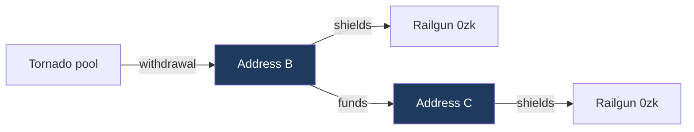

# Tornado Cash to Railgun

## Headline

| | Shielders | Share of all shielders |
|---|---:|---:|
| Reached at depth 0 or 1 | 1,899 | 6.49% |
| Depth 0, same address on both sides | 391 | 1.34% |
| Depth 1, funded by a withdrawal address | 1,508 | 5.15% |
| All Railgun shielders | 29,256 | 100% |

Depth 1 comes from 1,714 withdrawal address to shielder pairs, involving 1,016
distinct withdrawal addresses. The two depths are disjoint, so no shielder is
counted twice.

## Month by month

| Month | New shielders | Depth 1 | Share |
|---|---:|---:|---:|
| 2022-05 | 15 | 2 | 13.33% |
| 2022-06 | 23 | 7 | 30.43% |
| 2022-07 | 19 | 4 | 21.05% |
| **2022-08** | 66 | 20 | 30.30% |
| 2022-09 | 88 | 13 | 14.77% |
| 2022-10 | 61 | 10 | 16.39% |
| 2022-11 | 86 | 6 | 6.98% |
| 2022-12 | 96 | 11 | 11.46% |
| 2023-01 | 200 | 79 | 39.50% |
| 2023-02 | 155 | 11 | 7.10% |
| 2023-03 | 186 | 16 | 8.60% |
| 2023-04 | 253 | 25 | 9.88% |
| 2023-05 | 223 | 18 | 8.07% |
| 2023-06 | 259 | 43 | 16.60% |
| 2023-07 | 218 | 27 | 12.39% |
| 2023-08 | 253 | 24 | 9.49% |
| 2023-09 | 243 | 20 | 8.23% |
| 2023-10 | 282 | 28 | 9.93% |
| 2023-11 | 299 | 33 | 11.04% |
| 2023-12 | 292 | 31 | 10.62% |
| 2024-01 | 330 | 30 | 9.09% |
| 2024-02 | 252 | 23 | 9.13% |
| 2024-03 | 370 | 21 | 5.68% |
| 2024-04 | 408 | 21 | 5.15% |
| 2024-05 | 668 | 35 | 5.24% |
| 2024-06 | 626 | 46 | 7.35% |
| 2024-07 | 479 | 29 | 6.05% |
| 2024-08 | 706 | 33 | 4.67% |
| 2024-09 | 705 | 35 | 4.96% |
| 2024-10 | 606 | 23 | 3.80% |
| 2024-11 | 556 | 32 | 5.76% |
| 2024-12 | 534 | 28 | 5.24% |
| 2025-01 | 648 | 36 | 5.56% |
| 2025-02 | 604 | 21 | 3.48% |
| 2025-03 | 822 | 27 | 3.28% |
| 2025-04 | 867 | 30 | 3.46% |
| 2025-05 | 834 | 30 | 3.60% |
| 2025-06 | 787 | 37 | 4.70% |
| 2025-07 | 728 | 35 | 4.81% |
| 2025-08 | 1,166 | 38 | 3.26% |
| 2025-09 | 1,095 | 79 | 7.21% |
| 2025-10 | 1,118 | 51 | 4.56% |
| 2025-11 | 966 | 45 | 4.66% |
| 2025-12 | 1,443 | 64 | 4.44% |
| 2026-01 | 1,666 | 47 | 2.82% |
| 2026-02 | 978 | 27 | 2.76% |
| 2026-03 | 1,123 | 39 | 3.47% |
| 2026-04 | 943 | 26 | 2.76% |
| 2026-05 | 997 | 28 | 2.81% |
| 2026-06 | 1,075 | 34 | 3.16% |
| 2026-07 | 1,336 | 21 | 1.57% |
| 2026-08 | 503 | 9 | 1.79% |

August 2022, the designation month, is in bold. The first one hop shielder
appears in May 2022 and the busiest month is September 2025 with 79.

## Lag structure

Depth 1 has three events, so it has three intervals. This is the
operationally informative part.

| | Withdrawal to funding | Funding to shield | End to end |
|---|---:|---:|---:|
| Negative, out of order | 151, 8.8% | 200, 11.7% | 56, 3.3% |
| Same day | 260, 15.2% | 1,031, 60.2% | 216, 12.6% |
| 1 to 7 days | 51, 3.0% | 48, 2.8% | 51, 3.0% |
| 7 to 30 days | 71, 4.1% | 25, 1.5% | 62, 3.6% |
| 30 to 90 days | 84, 4.9% | 28, 1.6% | 68, 4.0% |
| 90 days to 1 year | 245, 14.3% | 56, 3.3% | 192, 11.2% |
| Over a year | 852, 49.7% | 326, 19.0% | 1,069, 62.4% |
| **Median** | **356.2 days** | **0.0 days** | **691.0 days** |

The shape is consistent and specific. The withdrawal address holds funds for a
long time, a median of nearly a year and almost half for more than one, and
then the recipient shields the same day it is paid in 60% of cases. The hop
itself is immediate. All of the delay sits upstream of it.

That is a recognisable operational signature. An address funded and used
within a single day, for the single purpose of shielding, is behaving as a
purpose created intermediate rather than as an ordinary wallet that happened
to receive a payment. It supports reading these chains as deliberate, while
the long upstream delay argues against any of it being a reaction to a
specific event.

Ordering is reported and never applied. The negative rows are pairs where the
events run the wrong way round, and they are counted rather than removed.

## Coverage and limits

| | |
|---|---:|
| Contracts emitting withdrawal events | 170 |
| Withdrawal events collected | 292,501 |
| Distinct recipients | 126,870 |
| Railgun shielders | 29,256 |
| Shielders with at least one funding row | 29,237, 99.9% |
| Funding edges examined | 1,872,205 |
| Blocks swept | 16,660,000 |

The withdrawal set is built from the `Withdrawal` event rather than from ETH
value transfers, so it covers every denomination. Pools paying out in DAI,
USDC, USDT or WBTC move no ETH and produce no value bearing trace, and are
therefore invisible to a trace based method. The event is emitted by the pool
contract regardless of what it pays out, which is what makes them visible here.

No address filter was applied when collecting, so the pool contracts were
discovered rather than supplied. 170 contracts emitted the event, which is
more than Tornado Cash deployed on Ethereum, so the set is likely to include
forks and unrelated contracts sharing the same event signature. That inflates
the recipient count by an unquantified amount.

Relayers are named separately by the event, in an indexed topic distinct from
the recipient field, so no frequency heuristic is used to separate them. They
are excluded by construction rather than by inference, and the relayer count
at every cutoff level is zero.

## Method comparison

The same question was answered twice, using collection methods that share
almost nothing. The first read ETH value transfers from traces, covering only
the ETH denominated pools, and separated relayers from recipients by payout
frequency. The second reads withdrawal events from logs, covering every
denomination, with relayers named explicitly.

| | Traces | Logs | Change |
|---|---:|---:|---:|
| Distinct recipients | 124,181 | 126,870 | +2.2% |
| Depth 0 | 384 | 391 | +1.8% |
| Depth 1 | 1,502 | 1,508 | +0.4% |
| Reached at depth 0 or 1 | 1,886 | 1,899 | +0.7% |

The two agree within two percent throughout. The result does not depend on
which method was used.

The payout counts are not comparable and should not be read as a loss. The
trace method recorded 498,710 payments because a relayed withdrawal pays twice
out of the pool, once to the recipient and once to the relayer. The log method
records 292,501 events, one per withdrawal. Payments fell while recipients
rose, which is what confirms the two are counting different things.

---

Generated from `withdrawals112.py`, `analysis11.py`, `timeline112.py` and
`report11.py`. Withdrawal set from `overlap112.db`, log based, all
denominations, no relayer cutoff applied.
