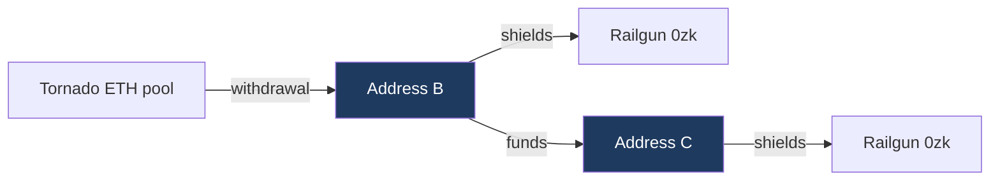

# Tornado Cash to Railgun

## Headline

| | Shielders | Share of all shielders |
|---|---:|---:|
| Reached at depth 0 or 1 | 1,886 | 6.45% |
| Depth 0, same address on both sides | 384 | 1.31% |
| Depth 1, funded by a withdrawal address | 1,502 | 5.13% |
| All Railgun shielders | 29,256 | 100% |

## Month by month

| Month | New shielders | Depth 0 | Share | Depth 1 | Share |
|---|---:|---:|---:|---:|---:|
| 2022-05 | 15 | 0 | 0.00% | 2 | 13.33% |
| 2022-06 | 23 | 0 | 0.00% | 6 | 26.09% |
| 2022-07 | 19 | 2 | 10.53% | 4 | 21.05% |
| **2022-08** | 66 | 0 | 0.00% | 20 | 30.30% |
| 2022-09 | 88 | 1 | 1.14% | 12 | 13.64% |
| 2022-10 | 61 | 0 | 0.00% | 10 | 16.39% |
| 2022-11 | 86 | 0 | 0.00% | 6 | 6.98% |
| 2022-12 | 96 | 2 | 2.08% | 11 | 11.46% |
| 2023-01 | 200 | 1 | 0.50% | 79 | 39.50% |
| 2023-02 | 155 | 5 | 3.23% | 10 | 6.45% |
| 2023-03 | 186 | 11 | 5.91% | 16 | 8.60% |
| 2023-04 | 253 | 10 | 3.95% | 25 | 9.88% |
| 2023-05 | 223 | 9 | 4.04% | 18 | 8.07% |
| 2023-06 | 259 | 5 | 1.93% | 43 | 16.60% |
| 2023-07 | 218 | 3 | 1.38% | 27 | 12.39% |
| 2023-08 | 253 | 8 | 3.16% | 25 | 9.88% |
| 2023-09 | 243 | 4 | 1.65% | 20 | 8.23% |
| 2023-10 | 282 | 6 | 2.13% | 28 | 9.93% |
| 2023-11 | 299 | 3 | 1.00% | 33 | 11.04% |
| 2023-12 | 292 | 10 | 3.42% | 31 | 10.62% |
| 2024-01 | 330 | 6 | 1.82% | 30 | 9.09% |
| 2024-02 | 252 | 2 | 0.79% | 23 | 9.13% |
| 2024-03 | 370 | 2 | 0.54% | 21 | 5.68% |
| 2024-04 | 408 | 2 | 0.49% | 21 | 5.15% |
| 2024-05 | 668 | 8 | 1.20% | 34 | 5.09% |
| 2024-06 | 626 | 14 | 2.24% | 46 | 7.35% |
| 2024-07 | 479 | 5 | 1.04% | 29 | 6.05% |
| 2024-08 | 706 | 6 | 0.85% | 33 | 4.67% |
| 2024-09 | 705 | 7 | 0.99% | 35 | 4.96% |
| 2024-10 | 606 | 3 | 0.50% | 22 | 3.63% |
| 2024-11 | 556 | 4 | 0.72% | 32 | 5.76% |
| 2024-12 | 534 | 3 | 0.56% | 29 | 5.43% |
| 2025-01 | 648 | 2 | 0.31% | 36 | 5.56% |
| 2025-02 | 604 | 1 | 0.17% | 21 | 3.48% |
| 2025-03 | 822 | 4 | 0.49% | 26 | 3.16% |
| 2025-04 | 867 | 18 | 2.08% | 29 | 3.34% |
| 2025-05 | 834 | 4 | 0.48% | 30 | 3.60% |
| 2025-06 | 787 | 4 | 0.51% | 38 | 4.83% |
| 2025-07 | 728 | 7 | 0.96% | 35 | 4.81% |
| 2025-08 | 1,166 | 6 | 0.51% | 38 | 3.26% |
| 2025-09 | 1,095 | 19 | 1.74% | 80 | 7.31% |
| 2025-10 | 1,118 | 14 | 1.25% | 51 | 4.56% |
| 2025-11 | 966 | 47 | 4.87% | 45 | 4.66% |
| 2025-12 | 1,443 | 16 | 1.11% | 64 | 4.44% |
| 2026-01 | 1,666 | 14 | 0.84% | 47 | 2.82% |
| 2026-02 | 978 | 4 | 0.41% | 27 | 2.76% |
| 2026-03 | 1,123 | 17 | 1.51% | 37 | 3.29% |
| 2026-04 | 943 | 2 | 0.21% | 25 | 2.65% |
| 2026-05 | 997 | 11 | 1.10% | 29 | 2.91% |
| 2026-06 | 1,075 | 28 | 2.60% | 34 | 3.16% |
| 2026-07 | 1,336 | 15 | 1.12% | 21 | 1.57% |
| 2026-08 | 503 | 9 | 1.79% | 8 | 1.59% |

August 2022, the designation month, is in bold.

## Lag structure

This is the operationally informative part, and it is where the two depths
differ most.

**Depth 0, withdrawal to shield**

| | Count | Share |
|---|---:|---:|
| Negative, out of order | 16 | 4.2% |
| Same day | 207 | 53.9% |
| 1 to 7 days | 22 | 5.7% |
| 7 to 30 days | 16 | 4.2% |
| 30 to 90 days | 13 | 3.4% |
| 90 days to 1 year | 9 | 2.3% |
| Over a year | 101 | 26.3% |

Median 0 days, longest 2,287 days.

**Depth 1, three legs**

| | Withdrawal to funding | Funding to shield | End to end |
|---|---:|---:|---:|
| Negative, out of order | 165, 9.7% | 199, 11.7% | 59, 3.5% |
| Same day | 256, 15.0% | 1,024, 60.0% | 209, 12.2% |
| 1 to 7 days | 51, 3.0% | 48, 2.8% | 50, 2.9% |
| 7 to 30 days | 71, 4.2% | 26, 1.5% | 62, 3.6% |
| 30 to 90 days | 86, 5.0% | 28, 1.6% | 68, 4.0% |
| 90 days to 1 year | 247, 14.5% | 54, 3.2% | 195, 11.4% |
| Over a year | 831, 48.7% | 328, 19.2% | 1,064, 62.3% |
| **Median** | **334.3 days** | **0.0 days** | **668.9 days** |

The shape is consistent and specific. The withdrawal address holds funds for a
long time, a median of eleven months and nearly half for over a year, and then
the recipient shields the same day it is paid in 60% of cases. The hop itself
is immediate. All of the delay sits upstream of it.

That is a recognisable operational signature. An address funded and used
within a single day, for the single purpose of shielding, is behaving as a
purpose created intermediate rather than as an ordinary wallet that happened
to receive a payment. It supports reading these chains as deliberate, while
the long upstream delay argues against any of it being a reaction to a
specific event.

At depth zero the same immediacy appears directly, with 53.9% withdrawing and
shielding on the same day.

## Coverage and limits

| | |
|---|---:|
| Pool contracts observed paying | 28 of 48 filtered |
| Payouts collected | 498,710 |
| Distinct addresses paid | 124,181 |
| Withdrawal set after relayer exclusion | 123,981 |
| Railgun shielders | 29,256 |
| Shielders with at least one funding row | 29,237, 99.9% |
| Funding edges examined | 1,872,205 |

The withdrawal set covers the ETH denominated pools only. Withdrawals from the
ERC-20 pools move DAI, USDC, USDT or WBTC rather than ETH and so produce no
value bearing trace. 28 of the 48 filtered contracts paid out at all, which is
consistent with that.

Relayers were separated from recipients by payout frequency, since a relayed
withdrawal pays both from the same pool. At the chosen cutoff of 100 payouts,
200 addresses were excluded.

---

Generated from `analysis11.py`, `timeline11.py` and `timeline112.py`. Relayer
cutoff 100. Designation block 15,307,000.
