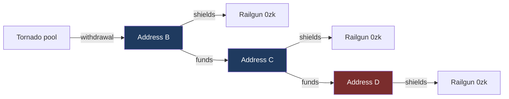

# Tornado Cash to Railgun

Measured connectivity between Tornado Cash withdrawal addresses and Railgun
shielding addresses, at depths zero, one and two. No time window is applied at
any stage.

The withdrawal set is restricted to contracts named in the OFAC designation of
8 August 2022. Measurement runs forward from each withdrawal recipient, sweeping
every payment it ever made, and intersects the result against the Railgun
shielding set.

## Headline

| | Shielders | Share of all shielders |
|---|---:|---:|
| Depth 0, same address on both sides | 387 | 1.32% |
| Depth 1, funded by a withdrawal address | 1,132 | 3.87% |
| Reached at depth 0 or 1 | **1,519** | **5.19%** |
| Depth 2, funded by a funder of one | 11,858 | 40.53% |
| All Railgun shielders | 29,256 | 100% |

Depth 1 comes from 1,244 chains involving 981 distinct withdrawal addresses.

## Depth 2 analysis

At two intermediates the candidate set reaches 11,858 shielders, **40.5% of
everyone who has ever used Railgun**. That is not a finding about Tornado. It is
a finding about how densely the transfer graph is connected.

149 intermediates account for 91.7% of it. The largest are:

| Intermediate | Shielders | What it is |
|---|---:|---|
| `0x4025ee65…` | 1,897 | contract |
| `0xac9f360a…` | 1,238 | **Railgun Relay Adapt** |
| `0x5c7bcd6e…` | 1,196 | contract |
| `0xc02aaa39…` | 1,063 | **WETH** |
| `0x9008d19f…` | 496 | **CoW Protocol settlement** |
| `0x11111112…` | 422 | **1inch router** |
| `0xdef1c0de…` | 254 | **0x Protocol proxy** |

A chain running Tornado exit to WETH to shielder means one person wrapped ETH
and an unrelated person later unwrapped some and shielded. They share a utility
contract and nothing else. The Relay Adapt case is sharper still: that is
Railgun's own infrastructure, so the chain reduces to the observation that both
parties used Railgun, which is the definition of the set being searched.

The designation comparison confirms it. Depth 2 is 99.7% post-designation
against a 99.8% baseline. Identical, which is what any measure capturing nearly
the whole population produces.

**This is a ceiling rather than a limitation of the collection.** The sweep
reached 1,826,874 addresses one hop from 125,359 seeds, a multiple of 14.6. A
second hop applied to 1.8 million addresses reaches a substantial share of all
active addresses on Ethereum, at which point membership establishes nothing. No
better node or longer sweep changes this.

| Depth | Shielders | Share | Reads as |
|---|---:|---:|---|
| 0 | 387 | 1.32% | specific |
| 1 | 1,132 | 3.87% | specific |
| 2 | 11,858 | 40.53% | uninformative |

## Timing

Across the 1,244 depth 1 chains, measured between the three events: the Tornado
withdrawal, the payment to the second address, and the shield.

| | Withdrawal to funding | Funding to shield | End to end |
|---|---:|---:|---:|
| Negative | 0, 0.0% | 216, 17.4% | 208, 16.7% |
| Same day | 596, 47.9% | 691, 55.5% | 208, 16.7% |
| 1 to 7 days | 89, 7.2% | 66, 5.3% | 89, 7.2% |
| 7 to 30 days | 96, 7.7% | 47, 3.8% | 105, 8.4% |
| 30 to 90 days | 91, 7.3% | 44, 3.5% | 110, 8.8% |
| 90 days to 1 year | 205, 16.5% | 105, 8.4% | 254, 20.4% |
| Over a year | 167, 13.4% | 75, 6.0% | 270, 21.7% |
| **Median** | **4.0 days** | **0.0 days** | **62.4 days** |

## Composition of the depth 1 chains

| | Chains | Share |
|---|---:|---:|
| Withdrawal address is a contract | 26 | 2.1% |
| Shielder is a contract | 32 | 2.6% |
| Withdrawal address funded over 20 shielders | 72 | 5.8% |
| Shielder held ETH before being funded | 270 | 21.7% |
| Shielder shielded only once | 720 | 57.9% |
| Withdrawal address used a relayer | 1,226 | 98.6% |
| Withdrawal address paid its own gas | 61 | 4.9% |
| Chain runs in the right order | 1,094 | 87.9% |

## Against the designation

| Population | Shielded on or after 8 Aug 2022 | Share |
|---|---:|---:|
| All shielders | 29,190 of 29,256 | 99.8% |
| Depth 1 | 1,111 of 1,132 | 98.1% |
| Depth 2 | 11,826 of 11,858 | 99.7% |

## Coverage

| | |
|---|---:|
| Designated addresses | 38 |
| Of those, emitting withdrawal events | 23 |
| Recipients, all emitting contracts | 127,137 |
| Recipients, designated contracts | 125,359 |
| Railgun shielders | 29,256 |
| Recipients queried by the sweep | 127,137, 100% |
| Actions collected | 17,204,941 |
| Addresses reached at one hop | 1,826,874 |

Every recipient was queried. 124,513 had at least one outgoing payment to
record; 2,624 made none.

The withdrawal set is built from the `Withdrawal` event rather than from ETH
value transfers, so it covers every denomination. Pools paying out in DAI, USDC,
USDT or WBTC move no ETH and produce no value bearing trace, and are invisible
to a trace based method.

Relayers are named separately by the event, in an indexed topic distinct from
the recipient field, so no frequency heuristic is used to separate them.
