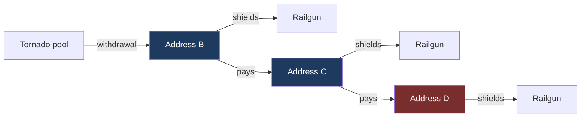

# Results

Measured connectivity between Tornado Cash withdrawal addresses and Railgun
shielding addresses. The withdrawal set is restricted to the contracts named in
the OFAC designation of 8 August 2022. No time window is applied at any stage.

| | Shielders reached | Share of 29,256 |
|---|---:|---:|
| **Depth 0**, one address did both | 387 | 1.32% |
| **Depth 1**, B paid C, C shielded | 1,132 | 3.87% |
| Reached at depth 0 or 1 | **1,519** | **5.19%** |
| Depth 2, two intermediates | 11,858 | 40.53% |

Depth 2 is reported for completeness and does not discriminate. Section 8
explains why.

---

## 1. What was collected

| | Count |
|---|---:|
| Contracts emitting the `Withdrawal` event | 170 |
| Of those, named in the OFAC designation | 23 of 38 |
| Withdrawal events, designated contracts | 281,497 |
| Distinct recipients, designated contracts | **125,359** |
| Deposit events | 311,199 |
| Deposit transactions resolved to a sender | 310,087, 99.6% |
| Railgun shielders | **29,256** |
| Outward payments from every recipient | 17,204,941 |
| Recipients queried by the forward sweep | 127,137, 100% |

The withdrawal set is built from the `Withdrawal` event rather than from ETH
transfers, so it covers every denomination. Pools paying DAI, USDC, USDT or WBTC
move no ETH and are invisible to a trace based sweep.

The unfiltered sweep found 170 emitting contracts against about twenty Tornado
deployed. The remainder are forks running the same public code, plus unrelated
contracts sharing an event signature. Six of the excluded forks are ETH mixers
whose first payout came within seven weeks of the designation.

779 events decoded a zero recipient and are excluded. 775 come from a handful of
transactions within sixteen blocks of the 0.1 ETH pool's deployment in December
2019, each emitting the event exactly 100 times, which is contract
initialisation.

---

## 2. Depth 0: one address did both

387 addresses appear in both lists. A set intersection, no payment tracing, no
judgement calls. Two independent collection methods produced the same figure.

**1.32% of all shielders, 95% interval 1.20 to 1.46%.** 380 and 1.30% after
removing every identifiable service.

### Four kinds of user

| Segment | Count | Share | ETH | Of value |
|---|---:|---:|---:|---:|
| Single use | 159 | 41.1% | 2,860.9 | 9.5% |
| Assembler | 135 | 34.9% | 8,167.5 | 27.0% |
| Returning | 86 | 22.2% | 3,530.5 | 11.7% |
| **Operator** | **7** | **1.8%** | **15,715.0** | **51.9%** |

Seven addresses hold more than half the value, averaging 2,245 ETH against 18
for the single use group.

Segment boundaries are judgement calls and were tested. The single use count is
exactly 159 at every operator cutoff from 10 to 200 withdrawals.

### Where the money came from

1,152 withdrawals fed these addresses.

| Pool | Withdrawals | Share | All Tornado | Ratio | ETH |
|---|---:|---:|---:|---:|---:|
| **100 ETH** | 274 | **26.1%** | 17.2% | **1.52x** | 27,400.0 |
| 10 ETH | 259 | 24.7% | 27.8% | 0.89x | 2,590.0 |
| 0.1 ETH | 259 | 24.7% | 22.2% | 1.11x | 25.9 |
| 1 ETH | 258 | 24.6% | 32.8% | 0.75x | 258.0 |

The largest pool is used half again as often as among Tornado users generally,
at z = 7.7, and carries 90.5% of the ETH.

Assets are reported separately: **30,273.9 ETH, 2,595,400 DAI, 1,200 USDT, 100
USDC.** Twelve addresses used token pools only and appear as zero in any ETH
figure; eight of them took a single 100,000 DAI withdrawal.

### Timing and arrival

52.7% shielded the same day they withdrew, 25.8% waited over a year, only 17.1%
fall between. Median 0.1 days. 17 addresses shielded before they withdrew.

| Cohort | Addresses | Share |
|---|---:|---:|
| 2020 to 2021, before | 58 | 15.0% |
| 2022 to 2024, designated | 123 | 31.8% |
| **2025 to 2026, after delisting** | **206** | **53.2%** |

The 53.2% has an interval of 48.3 to 58.2%. Tornado's own withdrawal volume in
that period was **30.2%** of all time, so the concentration is not a base rate
artefact.

---

## 3. Depth 0: the matched control

For each of the 387, a Tornado recipient was drawn who never shielded, matched
on first withdrawal year and main pool size. Repeated with three independent
samples.

| Measure | Depth 0 | Control range | Difference | Holds |
|---|---:|---:|---:|---|
| Used 2+ pool sizes | 26.1% | 9.6 to 15.0% | +11.1 to +16.5 pp | yes |
| Made 3+ withdrawals | 28.7% | 16.3 to 19.1% | +9.6 to +12.4 pp | yes |
| Clustered in time | 33.9% | 21.7 to 26.9% | +7.0 to +12.2 pp | yes |
| **Ever paid own gas** | **5.9%** | **5.9 to 7.0%** | **+0.0 to −1.1 pp** | **no** |
| **Relayed share** | **89.9%** | **87.6 to 93.9%** | **+2.3 to −4.0 pp** | **no** |

**Heavier users, not more careful ones.** Every activity measure is higher
across all three draws. Both discipline measures flip sign, which makes them
nulls rather than small effects.

Two apparent differences dissolve on inspection. The set used more distinct
relayers, but per withdrawal it is 0.114 against a control range of 0.105 to
0.130. And ETH withdrawn reads 1.5x, but one contract is 7,590 of the 30,274;
without it the ratio is 1.12x.

---

## 4. Depth 0: address reuse

Tornado's guarantee holds against the protocol, not against a user who deposits
and withdraws from the same address.

| | Count | Share |
|---|---:|---:|
| Distinct depositors, whole protocol | 65,226 | |
| Also appear as a withdrawal recipient | 11,976 | 18.4% |
| **Same address, same pool** | **8,533** | **13.1%** |
| | | |
| Depth 0 addresses that deposited | 63 | 16.3% of 387 |
| **Of those, same address same pool** | **46** | **11.9% of 387** |

The middle row means one address on both sides of the protocol somewhere. The
bold rows mean the same pool, which links the deposit and the withdrawal
directly.

Among depositors who also withdrew, 71.3% used the same pool. Within depth 0 it
is 73.0%. Statistically identical.

### But the value is concentrated

| | Addresses | ETH | Share |
|---|---:|---:|---:|
| All depth 0 | 387 | 30,273.9 | 100% |
| **Same address, same pool** | **46** | **12,568.7** | **41.5%** |
| Of which one contract | 1 | 7,590.0 | 25.1% |
| Accounts only | 380 | 22,559.7 | 100% |
| **Self matched accounts** | **45** | **4,978.7** | **22.1%** |

Report both. 41.5% with the contract, 22.1% without.

### Two patterns inside it

| By segment | Rate | | By cohort | Rate |
|---|---:|---|---|---:|
| Operator | 42.9% | | 2020 to 2021 | **25.9%** |
| Assembler | 18.5% | | 2022 to 2024 | 13.0% |
| Returning | 14.0% | | **2025 to 2026** | **7.3%** |
| Single use | 3.8% | | | |

Self matching concentrates in heavy users, z = 4.10, and **fell from 25.9% to
7.3%** across the cohorts, z = 3.94. Since cohort composition did not change,
that is a genuine behavioural trend.

The clearest single case is `0x5b33d097`, nine deposits and nine withdrawals
from the 100 ETH pool with one address, 900 ETH, then shielded.

---

## 5. Depth 0: gas price fingerprinting, a negative result

The method of Béres, Seres, Benczúr and Quintyne-Collins, applied to all 310,087
resolved deposits. Round values excluded as wallet defaults.

It produced six candidate pairs touching the depth 0 set. Checking how far apart
the two deposits sat destroyed all six.

| Pair | Gas price | Distance | Verdict |
|---|---:|---|---|
| A | 32.695010 | same block | network |
| A | 41.242001 | same block | network |
| B | 112.871855 | same block | network |
| C | 33.684435 | same block | network |
| D | 57.530741 | 4 blocks | network |
| E | 13.010000 | 270,551 blocks | round value, weak |

**Why same block is fatal.** Block builders order transactions by gas price, so
two transactions bidding the same price land in the same block by construction.
A shared price predicts a shared block and says nothing about a shared sender.

**Usable matches: zero.** The threshold was also barely selective: with 311,199
transactions across 182,539 distinct prices, an average price appears 1.7 times,
so 98% qualify as rare by construction.

Reported because a method run and failed is a different claim from a method not
attempted.

---

## 6. Depth 0: what can be traced

Four withdrawal side techniques.

| Segment | Count | Caught | Missed |
|---|---:|---:|---:|
| Assembler | 135 | 100% | 0 |
| Operator | 7 | 71.4% | 2 |
| Returning | 86 | 22.1% | 67 |
| **Single use** | **159** | **3.8%** | **153** |

222 of 387, 57.4% with an interval of 52.4 to 62.2%, trigger nothing.

Three of the four cannot fire on an address used once, so part of that is
definitional. These techniques detect address reuse and nothing else, and 41.1%
of this population did not reuse.

### Weighting by value inverts it

| | Addresses | Of 387 | ETH | Of value | Mean |
|---|---:|---:|---:|---:|---:|
| Caught by something | 165 | 42.6% | 24,782.6 | **81.9%** | 150.2 |
| **Caught by nothing** | **222** | **57.4%** | 5,491.3 | **18.1%** | 24.7 |

**Published techniques miss 57.4% of the addresses but only 18.1% of the money.**
The untraceable population is poor: 24.7 ETH on average against 150.2.

This weakens any claim that the population is broadly beyond reach and
strengthens the narrower claim that most individuals cannot be identified.

---

## 7. Depth 1: chains with an intermediate

1,244 chains where B withdrew, B paid C, and C shielded.

**Four denominators, not interchangeable.** Chains 1,244. B addresses 981. C
addresses 1,132. All shielders 29,256. There are more chains than addresses
because some B paid several C and some C were paid by several B.

### Chain shape

| Shape | Chains | Share | B addresses | ETH | Of value |
|---|---:|---:|---:|---:|---:|
| **One to one** | **752** | **60.5%** | 752 | 86,057.2 | **81.2%** |
| One B, many C | 235 | 18.9% | 77 | 4,442.1 | 4.2% |
| Many B, one C | 146 | 11.7% | 146 | 14,311.6 | 13.5% |
| Service fan out | 72 | 5.8% | **2** | 370.1 | **0.3%** |
| Many to many | 39 | 3.1% | | | |

Six chains in ten are the simple case. The service group is **two addresses**,
one a Binance hot wallet paying 41 shielders, and carries 0.3% of the value.

91% of the C addresses in "many B, one C" had a transaction history before being
paid, against 55% for one to one chains, which fits a collection point rather
than a fresh conduit.

### The B addresses

| Segment | B addresses | Share | ETH | Of value |
|---|---:|---:|---:|---:|
| Single use | 547 | 55.8% | 13,828.3 | 13.1% |
| **Assembler** | **356** | **36.3%** | **83,904.2** | **79.2%** |
| Returning | 71 | 7.2% | | |
| Operator | 7 | 0.7% | 5,367.4 | 5.1% |

3,799 withdrawals, 3.87 per B address, against 2.98 at depth 0 and 2.30 across
Tornado. 92.2% relayed, 7.8% paid their own gas.

**Value concentration is the reverse of depth 0.** There seven operators hold
51.9%; here they hold 5.1% and assemblers dominate at 79.2%.

### The C addresses

| | Chains | Share |
|---|---:|---:|
| **Had never sent a transaction before** | **443** | **35.6%** |
| Already held ETH before being paid | 270 | 21.7% |
| Shielded only once | 720 | 57.9% |
| Events ran in the right order | 1,094 | 87.9% |

Transaction count rises only when an address *sends*, so 443 addresses had done
nothing at all before the shield.

### Timing

Two gaps, and they behave completely differently.

| Gap 2, being paid to shielding | Chains | Share |
|---|---:|---:|
| **Same hour** | **800** | **64.3%** |
| Same day | 87 | 7.0% |
| Shielded before being paid | 150 | 12.1% |
| **Median** | | **4 minutes** |

| Gap 1, Tornado to the payment | Chains | Share |
|---|---:|---:|
| Same hour | 179 | 14.4% |
| Over a year | 511 | 41.1% |
| **Median** | | **6.5 months** |

A quarter of chains had gap 1 under 4.9 days and a quarter over 2.2 years.

**The two gaps are independent.**

| | Chains | Shielded same day |
|---|---:|---:|
| B paid within a week | 326 | 78.8% |
| B waited over a year | 511 | 78.3% |

How long B held the money says nothing about how fast C acted once paid.

### Depth 1 control

| Measure | Ended in Railgun | Went elsewhere | Difference |
|---|---:|---:|---:|
| **Withdrew 3+ times** | **33.1%** | **19.9%** | **+13.3 pp** |
| Used 2+ pool sizes | 20.2% | 13.1% | +7.1 pp |
| Withdrawals, mean | 3.87 | 2.43 | 1.59x |
| **Ever paid own gas** | **4.9%** | **4.0%** | **+0.9 pp** |

The control is another chain, B′ pays C′ where C′ never shielded, drawn from the
forward graph and matched on year and pool size. Same finding as depth 0:
heavier users, not more careful.

Pool mix inverts. The 100 ETH pool runs at 0.91x against the control, where
depth 0 ran at 1.52x against the population. Chains with an intermediate were
not the largest movements.

### What can be traced

| | Chains | Share | ETH | Of value |
|---|---:|---:|---:|---:|
| At least one signal | 746 | 60.0% | 118,140.5 | **92.4%** |
| **No signal** | **498** | **40.0%** | 9,775.2 | **7.6%** |

Same shape as depth 0 and stronger.

### Exclusions

Twelve B addresses are services: exchange wallets, relayers, and addresses with
dozens of withdrawals.

| | As measured | Excluding |
|---|---:|---:|
| Chains | 1,244 | 1,162 |
| Shielders reached | 1,132 | 1,063 |
| Share of 29,256 | 3.87% | 3.63% |

The fan out threshold is fragile. At a cap of 50 the category empties entirely,
because the largest fan out is 41.

---

## 8. Depth 2 does not discriminate

At two intermediates the candidate set reaches 11,858 shielders, **40.5% of
everyone who has used Railgun**.

149 intermediates account for 91.7% of it, and they are utilities almost
everyone touches:

| Intermediate | Shielders | What it is |
|---|---:|---|
| `0xac9f360a…` | 1,238 | **Railgun Relay Adapt** |
| `0xc02aaa39…` | 1,063 | **WETH** |
| `0x9008d19f…` | 496 | **CoW Protocol** |
| `0x11111112…` | 422 | **1inch** |
| `0xdef1c0de…` | 254 | **0x Protocol** |

A chain running Tornado exit to WETH to shielder means one person wrapped ETH
and an unrelated person later unwrapped some. The Relay Adapt case reduces to
both parties having used Railgun.

**This is a ceiling rather than a limitation of the collection.** The sweep
reached 1,826,874 addresses one hop from 125,359 seeds, a multiple of 14.6. A
second hop reaches a substantial share of all active addresses.

Depth 2 is 99.7% post designation against a 99.8% baseline. Identical, which is
what any measure capturing nearly the whole population produces.

---

## 9. The two depths side by side

| | Depth 0 | Depth 1 |
|---|---:|---:|
| Shielders reached | 387, 1.32% | 1,132, 3.87% |
| After removing services | 380, 1.30% | 1,063, 3.63% |
| Withdrawal addresses used once | 41.1% | 55.8% |
| Withdrawals per address | 2.98 | 3.87 |
| Paid own gas | 10.1% | 7.8% |
| Value held by operators | **51.9%** | 5.1% |
| Value held by assemblers | 27.0% | **79.2%** |
| 100 ETH pool | 1.52x over | 0.91x under |
| | | |
| **Arrived before the sanction** | 15.0% | **29.8%** |
| **Arrived during it** | 31.8% | **46.5%** |
| **Arrived after it was lifted** | **53.2%** | 23.6% |
| | | |
| Money in traceable addresses | 81.9% | 92.4% |

**Read the middle block.** Direct connections cluster after the sanction was
lifted. Chains with an intermediate cluster during it. Opposite directions.

Chain shapes support it: simple one to one chains rose from 44% to 66% to 70%
across the three periods, and service fan out fell to zero. Every chain
involving an exchange style address predates 2025.

The reading is that while the sanction was active people inserted a step, and
once it was lifted they stopped. That is a behavioural response to a
designation, and neither depth could have shown it alone.

---

## 10. Corrections

Figures previously published here that did not survive checking.

| Was | Is | Why |
|---|---|---|
| Depth 1 timing, 4.0 days | ~197 days | Cannot be reproduced by either definition. Both give 197 |
| Depth 1 value, 127,915 ETH | 105,927 ETH | Counted a B address once per chain |
| Service fan out, 9.0% of value | 0.3% | Same counting error. Two addresses |
| Depth 1 backward, 1,471 shielders | 1,132 | Exchange hot wallets counted their own customers |
| Depth 1 timing, 362 and 698 days | see above | Computed on the contaminated set |
| Seven contracts hold 25.5% | One contract holds 25.1% | Six hold 124 ETH between them |

Each was found by running the same question two ways, not by inspection.

---

## 11. What cannot be claimed

That gas price fingerprinting works here. Run at full coverage, zero usable
matches.

That 387 addresses are 387 people. Strict linking gives at most 371, and the
true figure is lower. No equivalent work has been done for depth 1.

That the designation caused migration. Depth 0 concentrates after the sanction
was lifted, and the pools were never frozen: they are immutable contracts and
withdrawals continued throughout at roughly 1,400 a month.

That four independent techniques failed on the majority. Three cannot fire on an
address used once.

---

## 12. Known gaps

| Gap | Consequence |
|---|---|
| **Railgun unshields were never collected** | **The largest gap. Whether these addresses took the money back out is unknown, so Railgun as a hop cannot be separated from Railgun as storage** |
| Railgun records begin May 2022 | Only 57 shielders predate the designation |
| Depth 1 clustering never run | 981 B addresses have not been reduced to actors |
| Depth 1 control drawn once | Depth 0 used three seeds; depth 1 has one |
| Seven deposit block ranges timed out | 7,000 blocks of 16.7 million, 0.04% |
| Three of seven depth 0 operators unidentified | Defined only by shielding 11 to 20 times |

---

## Data

| File | Contents |
|---|---|
| [ADDRESSES.md](ADDRESSES.md) | The 387 depth 0 addresses, one row each |
| [address_profiles.csv](address_profiles.csv) | The same, 34 columns |
| [CHAINS.md](CHAINS.md) | The 1,244 depth 1 chains |
| [chain_profiles.csv](chain_profiles.csv) | The same, 31 columns |
| [TIMING.md](TIMING.md) | Every chain with all three gaps |
| [chain_timing.csv](chain_timing.csv) | The same, in days |
| [address_match.csv](address_match.csv) | Deposit and withdrawal counts per address |
| [top_holders.csv](top_holders.csv) | Depth 0 with account or contract labels |

Full narrative in **[DEPTH0.pdf](DEPTH0.pdf)** and **[DEPTH1.pdf](DEPTH1.pdf)**.

---

Withdrawal set from contracts named in the OFAC designation of 8 August 2022,
collected from the `Withdrawal` event, all denominations, no relayer cutoff and
no time window. Depth 1 measured by forward expansion at 100% coverage.
